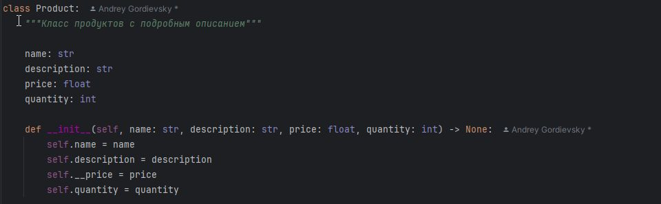
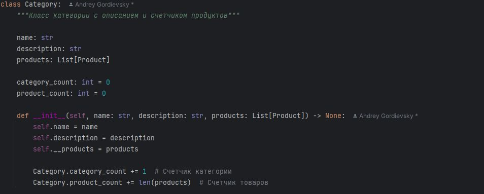
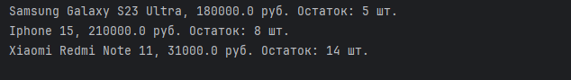
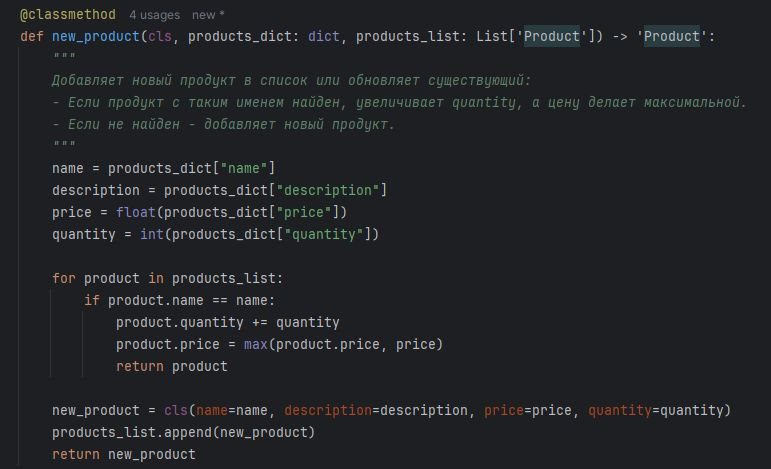
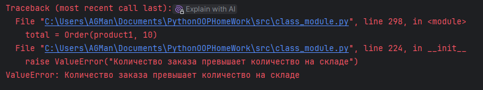
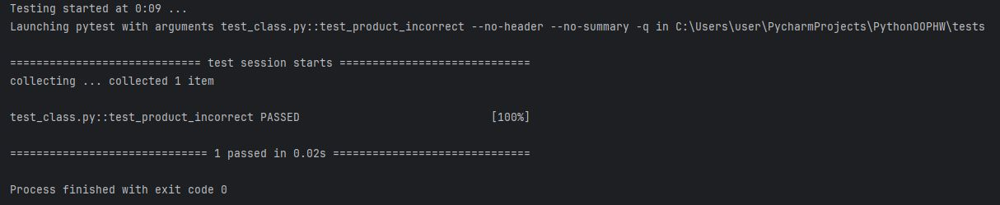
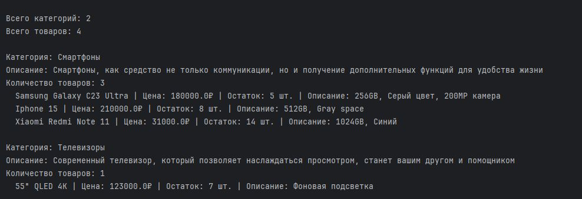

 
<h3 style="background: linear-gradient(1deg, gold, red); -webkit-background-clip: text; color: transparent;">
  Проект "Оболочка интернет - магазина"
</h3> 

# 🔖 Описание проекта:

Данный проект реализует "ядро" будущего интернет - магазина.


# 🔧 Установка компонентов:


1. Создайте проект и установите poetry:


```pip install --user poetry```
2. Клонируйте репозиторий:


```git clone https://github.com/StreetShiffter/PythonOOPHW.git```

3. Установите инструменты для обработки кода


# ✒️ Использование

Модуль **class_module.py** реализует создание классов продуктов и категории.






*ИЗМЕНЕНИЯ v5*

- Добавлен метод наследник от класса *Category* для добавления нового продукта с проверкой:
```
 def add_product(self, product: 'Product') -> None:
        """Метод добавления нового продукта"""
        if not isinstance(product, Product):
            raise TypeError("Можно добавлять только объекты класса Product или его наследников")
        self.__products.append(product)
        Category.product_count += 1
```
- Так как продукты в классе *Category* имеют статус приватный, был реализован геттер
```
@property# type: ignore
    def products(self) -> str:
```
- Реализовано кастомное создание товара в классе *Product*


- Цена в классе *Product* стала приватной - был добавлен геттер
```
@property# type: ignore
    def price(self) -> float:
        """Вызов цены в приватном статусе"""
        return self.__price
```
 и сеттер:
```
    @price.setter
    def price(self, new_price: float) -> None:
        """Корректор цены приватного статуса"""
        if new_price <= 0:
            print("Цена не должна быть нулевая или отрицательная")
            return
        if new_price < self.__price:
            answer = input(
                f"Новая цена {new_price} ниже текущей {self.__price}. Подтвердите изменение (y/n): "
            ).lower()
            if answer != "y":
                print("Изменение цены отменено")
                return

        self.__price = new_price
        print(f"Цена успешно изменена на {self.__price}")
```
- Реализован итератор для показа продуктов в категории:
```
class Iterator:
    """Класс для итерации и показ товар категории"""
    def __init__(self, category_item):
        self.category_item = category_item

    def __iter__(self):
        self.__index = 0
        return self

    def __next__(self):
        products = self.category_item.get_products()
        if self.__index < len(products):
            product = products[self.__index]
            self.__index += 1
            return product
        else:
            raise StopIteration
```
- Дополнены дочерние классы Product("Smartphone", "LawnGrass")
 *реализуют новые объекты по разным категориям*

-Использована новая проверка для добавления "правильных" продуктов в одну категорию.
Для реализации выполните тестирующие комманды
```
smartphone1 = Smartphone(
        "Samsung Galaxy S23 Ultra", "256GB, Серый цвет, 200MP камера", 180000.0, 5, 95.5, "S23 Ultra", 256, "Серый"
    )
    smartphone2 = Smartphone("Iphone 15", "512GB, Gray space", 210000.0, 8, 98.2, "15", 512, "Gray space")
    smartphone3 = Smartphone("Xiaomi Redmi Note 11", "1024GB, Синий", 31000.0, 14, 90.3, "Note 11", 1024, "Синий")
    
grass1 = LawnGrass("Газонная трава", "Элитная трава для газона", 500.0, 20, "Россия", "7 дней", "Зеленый")
grass2 = LawnGrass("Газонная трава 2", "Выносливая трава", 450.0, 15, "США", "5 дней", "Темно-зеленый")

category_list1 = [smartphone1, smartphone2]
    category_list2 = [grass1, grass2]
    cat1 = Category("Смартфоны", "Электроника", category_list1)
    cat2 = Category("Садовая продукция", "Газонная трава", category_list2)
    
 #Отладочный вызов кода 
 
    cat1.product_check_list()
    print("*" * 10)
    cat1.add_product(grass1)
    cat1.product_check_list()

    smartphone_sum = smartphone1 + smartphone2
    print(smartphone_sum)

    smartphone_sum = smartphone1 + grass1
    print(smartphone_sum)

    grass_sum = grass1 + grass2
    print(grass_sum)

```
- Реализован новый класс Order
 *Принимает аргумент продукта и количество заказов*

При превышении количества товаров по отношению количества оставшиеся на складе, будет вызвана ошибка:
- 


# 🔍 Тестирование:
Реализованы тестирующие модули для модулей приложения.

| Основа          | Тесты         |
|-----------------|---------------|
| class_module.py | test_class.py |
| mixin_module.py | test_mixin.py |
| Фикстуры тестов | conftest.py   |
 

*Для проверки тестирования воспользуйтесь командами в терминале:* 

`pytest`
или
`pytest имя_пакета\имя_модуля`

При успешном тестировании будет получены результаты положительного тестирования:



pytest --cov # тест покрытия
start htmlcov/index.html  __# запуск отчета в браузере__


***Модуль conftest.py используется для данных тестирования функций.***

*Для полной работы установите фреймворк pytest через poetry*

`poetry add --group dev pytest`

# 📤 Отчет в HTML:

**Для получения отчетов в формате html, воспользуйтесь командами**
```
pytest --cov=src --cov-report=html # формировка отчета для папки src
pytest --cov-report=html # формировка отчета для папки src
pytest --cov # тест покрытия
start htmlcov/index.html  # запуск отчета в браузере

```

Для запуска отчета в браузере:
- на ***Windows***: `start htmlcov/index.html`
- на ***macOS***: `open htmlcov/index.html`
- на ***Linux***: `xdg-open htmlcov/index.html`


# 📂 Работа с JSON:
Реализовано преобразование объектов из JSON
````
    def restract_object(path_file: str) -> list[Category]:
    """Функция берет JSON и преобразует объекты"""
    with open(path_file, "r", encoding="utf-8") as file:
        data = json.load(file)

        categories = []
        for category_data in data:
            products = []
            for product_data in category_data["products"]:
                product = Product(
                    name=product_data["name"],
                    description=product_data["description"],
                    price=product_data["price"],
                    quantity=product_data["quantity"],
                )
                products.append(product)

            category = Category(
                name=category_data["name"], description=category_data["description"], products=products
            )
            categories.append(category)
        return categories
````
Пример итоговой работы:


# 📝 Документация 

Для получения дополнительной информации обратитесь к [документации](README.md)
